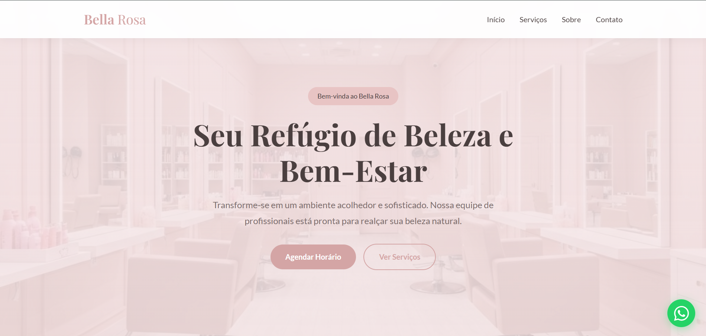
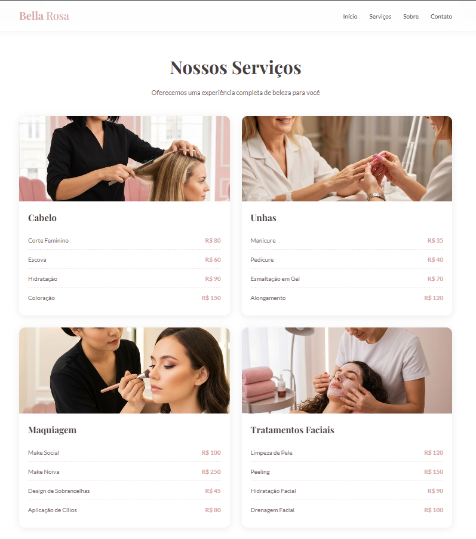
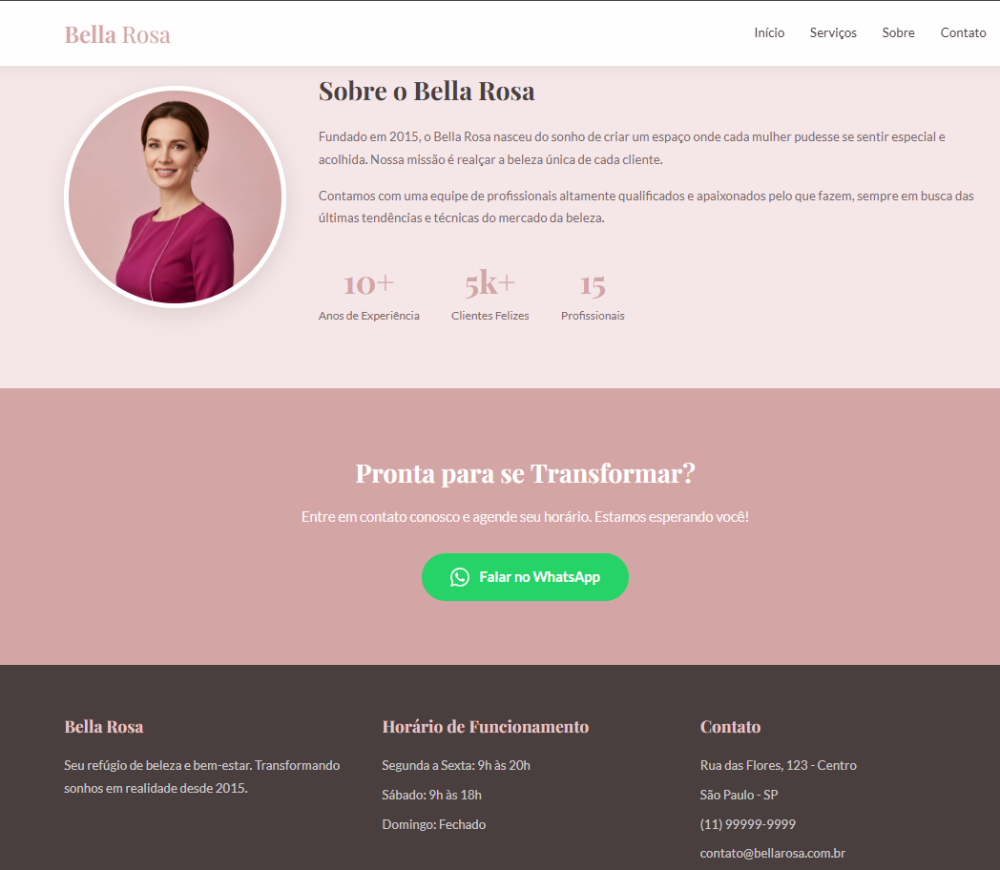

<h1 align="center">💇 Bella Rosa — Landing Page</h1>

<p align="center">
  Landing page responsiva para salão de beleza, desenvolvida com foco em <strong>UX/UI</strong>, boas práticas de HTML/CSS/JS e integração com WhatsApp.
</p>

<p align="center">
  <a href="https://noidzika.github.io/Modelo_Site_de_Negocio_03-SalaoDeBeleza/" target="_blank">
    
  </a>
</p>
<p align="center">
  
</p>

---

## 📸 Preview

<table>
  <tr>
    <td></td>
    <td></td>
  </tr>
  <tr>
    <td align="center"><em>Primeira impressão</em></td>
    <td align="center"><em>Cards de serviços</em></td>
  </tr>
</table>

<p align="center">
  
  <br/><em>Seção Sobre + Rodapé responsivo</em>
</p>

---

## 🎯 Sobre o projeto

Este projeto é um **modelo de landing page comercial** desenvolvido com o tema de salão de beleza, pensado para demonstrar habilidades em desenvolvimento front-end. O design e a estrutura foram criados do zero com foco em:

- Experiência do usuário agradável e intuitiva (UX)
- Interface limpa e visualmente atrativa (UI)
- Responsividade total — funciona em mobile, tablet e desktop
- Integração com o **WhatsApp**

### `O projeto pode ser facilmente adaptado para outros tipos de negócio.`

---

## ✨ Funcionalidades

- ✅ Navbar com scroll suave entre seções
- ✅ Hero section com chamada para ação (CTA)
- ✅ Cards de serviços com preços
- ✅ Seção "Sobre" com métricas do negócio
- ✅ Integração com WhatsApp (botão flutuante + CTAs)
- ✅ Rodapé com horários, endereço e contato
- ✅ Layout 100% responsivo

---

## 🛠️ Tecnologias utilizadas

| Tecnologia | Uso |
|---|---|
|  | Estrutura semântica da página |
|  | Estilização, responsividade (Flexbox/Grid) |
|  | Interações, menu mobile, scroll |

---

## 📂 Estrutura de pastas

```
📦 Modelo_Site_de_Negocio_03-SalaoDeBeleza
├── 📁 css/          # Estilos da página
├── 📁 js/           # Scripts de interação
├── 📁 imagens/      # Imagens do site
├── 📁 arquivosReadmeMd/  # Screenshots para o README
└── index.html       # Arquivo principal
```

---

## 🚀 Como rodar localmente

```bash
# Clone o repositório
git clone https://github.com/noidzika/Modelo_Site_de_Negocio_03-SalaoDeBeleza.git

# Entre na pasta
cd Modelo_Site_de_Negocio_03-SalaoDeBeleza

# Abra o arquivo no navegador
# Basta abrir o index.html diretamente, sem necessidade de servidor
```

---

## 📬 Contato

Desenvolvido por **Ulisses Oliveira**

[](https://www.linkedin.com/in/SEU-PERFIL-AQUI)
[](https://github.com/noidzika)
